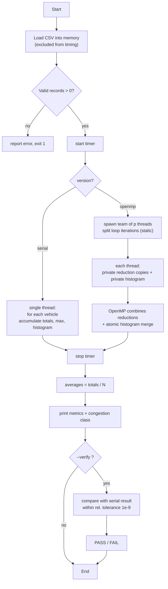

# Module I — Algorithm, Pseudocode, Flowchart

Both implementations share the same mathematical kernel; only the
*aggregation strategy* differs. Keeping the arithmetic identical is what
makes serial-vs-parallel verification meaningful.

## Metrics computed

For a dataset of N vehicle records, each with
`speed sᵢ`, `travel_time tᵢ`, `waiting_time wᵢ`, `distance dᵢ`:

```
count            = N
total_speed      = Σ sᵢ                       avg_speed        = total_speed / N
total_travel     = Σ tᵢ                       avg_travel       = total_travel / N
total_waiting    = Σ wᵢ                       avg_waiting      = total_waiting / N
total_distance   = Σ dᵢ                       avg_distance     = total_distance / N
max_travel       = max tᵢ                     max_waiting      = max wᵢ
total_delay      = Σ (wᵢ / tᵢ if tᵢ>0 else 0) avg_delay_ratio  = total_delay / N
speed_histogram  = count of sᵢ in 7 buckets   [0,5)[5,10)…[30,∞)
congestion_class = f(avg_speed)               FREE-FLOW / SLOW / CONGESTED
```

## 1. Serial algorithm

```
ALGORITHM analyze_serial(vehicles)
INPUT : array vehicles[0 .. N-1] of Vehicle{s,t,w,d}
OUTPUT: AnalysisResult R

 1  R.count ← N
 2  R.total_speed ← 0;  R.total_travel ← 0;  R.total_waiting ← 0
 3  R.total_distance ← 0;  R.total_delay ← 0
 4  R.max_travel ← 0;  R.max_waiting ← 0
 5  R.histogram[0..6] ← 0
 6  for i ← 0 to N-1 do                     // single pass, in order
 7      v ← vehicles[i]
 8      R.total_speed    ← R.total_speed    + v.speed
 9      R.total_travel   ← R.total_travel   + v.travel_time
10      R.total_waiting  ← R.total_waiting  + v.waiting_time
11      R.total_distance ← R.total_distance + v.distance
12      R.max_travel  ← max(R.max_travel,  v.travel_time)
13      R.max_waiting ← max(R.max_waiting, v.waiting_time)
14      R.total_delay ← R.total_delay + (v.waiting_time / v.travel_time
15                                        if v.travel_time > 0 else 0)
16      bucket ← speed_bucket(v.speed)
17      R.histogram[bucket] ← R.histogram[bucket] + 1
18  end for
19  if N > 0 then
20      R.avg_speed    ← R.total_speed    / N
21      R.avg_travel   ← R.total_travel   / N
22      R.avg_waiting  ← R.total_waiting  / N
23      R.avg_distance ← R.total_distance / N
24      R.avg_delay    ← R.total_delay    / N
25  return R
```

The loop body performs a constant amount of work per record and each
iteration is independent of every other (it only *reads* `vehicles[i]`).

## 2. Parallel (OpenMP) algorithm

```
ALGORITHM analyze_openmp(vehicles, num_threads)
INPUT : array vehicles[0 .. N-1], requested team size num_threads
OUTPUT: AnalysisResult R

 1  R.count ← N
 2  totals/maxima/delay ← 0                     // reduction targets
 3  PARALLEL REGION with num_threads threads
 4      each thread: local_hist[0..6] ← 0        // private partial histogram
 5      #pragma omp for  schedule(static)
          for i ← 0 to N-1 do                    // iterations split across threads
 6          v ← vehicles[i]                      // read-only shared access
 7          accumulate v into thread-private reduction copies:
 8              + speed, travel, waiting, distance, delay
 9              max travel, max waiting
10          local_hist[speed_bucket(v.speed)] ← local_hist[...] + 1
11      end for                                   // implicit barrier
12      // OpenMP combines the private + and max copies into the shared totals
13      for b ← 0 to 6 do
14          atomic: R.histogram[b] ← R.histogram[b] + local_hist[b]
15  END PARALLEL REGION
16  if N > 0 then averages ← totals / N
17  return R
```

Key differences from the serial version, all provided by OpenMP:

* **Work distribution** — `schedule(static)` splits the N iterations into
  contiguous chunks handed to the threads; correct here because every
  iteration does identical work (no load imbalance).
* **Reduction** — `reduction(+:…)` and `reduction(max:…)` give each thread a
  private accumulator and combine them once at the end, eliminating the data
  race a naive shared `+=` would cause.
* **Histogram** — not expressible as a scalar reduction, so each thread keeps
  a private 7-counter histogram and merges it with 7 atomic adds.

## 3. Flowchart



## Manually verifiable worked example

The 3-vehicle specification dataset (in `tests/test_correctness.cpp`):

| Vehicle | Speed | Travel time | Waiting time | Distance |
|---------|-------|-------------|--------------|----------|
| V1 | 10 | 100 | 20 | 900  |
| V2 | 20 | 80  | 10 | 1200 |
| V3 | 15 | 90  | 15 | 1000 |

Hand computation:

```
count            = 3
total_speed      = 10+20+15        = 45     avg_speed    = 45/3   = 15
total_travel     = 100+80+90       = 270    avg_travel   = 270/3  = 90
total_waiting    = 20+10+15        = 45     avg_waiting  = 45/3   = 15
total_distance   = 900+1200+1000   = 3100   avg_distance = 3100/3 = 1033.33…
max_travel       = 100             max_waiting = 20
```

`test_correctness` asserts exactly these values, and that the OpenMP kernel
(1/2/4/8 threads) reproduces them. Both must hold before any benchmark
number is considered trustworthy.
