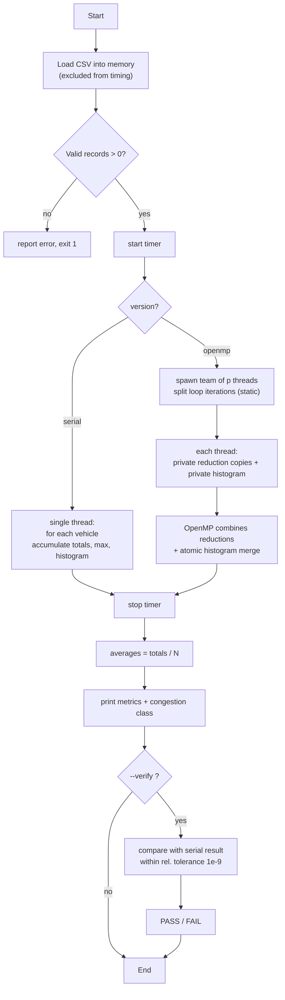

# SumoPara 


# MODULE I — Serial Implementation & Analysis

## 1. Objective

Traffic micro-simulators such as SUMO (Simulation of Urban MObility) produce
very large volumes of per-vehicle output: for every simulated vehicle they
record its speed, travel time, waiting time, and distance travelled.
Extracting useful traffic-engineering knowledge from this raw output —
average speeds, total delay, congestion indicators, speed distributions —
means aggregating over *millions* of independent vehicle records.

The objective of this project is to:

1. implement a correct, validated **serial** C++17 program that computes these
   aggregate traffic metrics from a CSV dataset, and
2. implement an **OpenMP parallel** version of the *same* computation,
3. **measure** the performance difference honestly (speedup and efficiency
   across dataset sizes and thread counts), and
4. analyse *why* the observed scaling is what it is.

**Scope boundary.** SUMO is used **only as a data generator**. Its internal
simulation engine is **not** modified, instrumented, or parallelized. The
parallelization target is the vehicle-data *analysis loop* over the exported
CSV.

## 2. System workflow

```
SUMO Simulation ──► tripinfo.xml ──► CSV ──► C++ Analysis ──┬─ Serial  (traffic_analysis_serial)
  (data generator    (converter)                            └─ OpenMP  (traffic_analysis_openmp)
   only)                                                              │
                                                              Performance Analysis
                                                              (benchmarks/run_benchmark.py)
```

Given a CSV of vehicle records

```
vehicle_id,speed,travel_time,waiting_time,distance
veh_0,7.1380,1012.2263,189.5794,7044.8040
...
```

the analyzer computes, in a single pass over the data:

| Category    | Metrics |
|-------------|---------|
| Count       | vehicle count |
| Speed       | total & average speed, 7-bucket speed histogram |
| Travel time | total, average, maximum |
| Waiting     | total, average, maximum waiting time |
| Distance    | total & average distance |
| Delay       | average delay ratio (waiting / travel) |
| Congestion  | classification from average speed (FREE-FLOW / SLOW / CONGESTED) |

Because the analyzer consumes a plain CSV, it works identically on **real
SUMO output** (the `sumo/` scenario) and on **deterministic synthetic
datasets** (`tools/generate_dataset.cpp`), so the whole experiment is
reproducible on machines without SUMO installed.

## 3. Serial algorithm (pseudocode)

```
ALGORITHM analyze_serial(vehicles)
INPUT : array vehicles[0 .. N-1] of Vehicle{speed, travel, waiting, distance}
OUTPUT: AnalysisResult R

 1  R.count ← N
 2  totals/maxima ← 0 ; histogram[0..6] ← 0
 3  for i ← 0 to N-1 do                     // single pass, in order
 4      v ← vehicles[i]
 5      total_speed    ← total_speed    + v.speed
 6      total_travel   ← total_travel   + v.travel_time
 7      total_waiting  ← total_waiting  + v.waiting_time
 8      total_distance ← total_distance + v.distance
 9      max_travel  ← max(max_travel,  v.travel_time)
10      max_waiting ← max(max_waiting, v.waiting_time)
11      total_delay ← total_delay + (v.waiting_time / v.travel_time
12                                  if v.travel_time > 0 else 0)
13      histogram[speed_bucket(v.speed)] ← histogram[bucket] + 1
14  end for
15  if N > 0 then averages ← totals / N
16  return R
```

The loop body performs a constant amount of work per record, and each
iteration only *reads* `vehicles[i]` — it never writes the array or any other
record. That independence is exactly what makes the loop parallelizable in
Module II.

## 4. Flowchart



## 5. Manually verifiable test case

The 3-vehicle specification dataset (asserted in `tests/test_correctness.cpp`):

| Vehicle | Speed | Travel time | Waiting time | Distance |
|---------|-------|-------------|--------------|----------|
| V1      | 10    | 100         | 20           | 900      |
| V2      | 20    | 80          | 10           | 1200     |
| V3      | 15    | 90          | 15           | 1000     |

Hand computation:

```
count            = 3
total_speed      = 10+20+15        = 45     avg_speed    = 45/3   = 15
total_travel     = 100+80+90       = 270    avg_travel   = 270/3  = 90
total_waiting    = 20+10+15        = 45     avg_waiting  = 45/3   = 15
total_distance   = 900+1200+1000   = 3100   avg_distance = 3100/3 = 1033.33…
max_travel       = 100             max_waiting = 20
```

`test_correctness` asserts exactly these values **and** that the OpenMP kernel
(1/2/4/8 threads) reproduces them. Both must hold before any benchmark number
is considered trustworthy.

## 6. Complexity

**Time — O(N).** Both kernels make exactly one pass over the N records; the
per-record work is a fixed constant (5 FP adds, 2 max comparisons, 1 guarded
division, a histogram bucket pick + increment). There is no nested loop and no
per-record dependence on other records, so `T(N) = c·N ∈ O(N)`. This is
confirmed empirically: measured computation time grows linearly with dataset
size (~100× from 100K to 10M). The OpenMP version changes the *constant
factor*, not the asymptotic class: `T_p(N) ≈ c·N/p + overhead(p)` is still
Θ(N) for fixed `p`.

**Space — O(N).** Records are stored in `std::vector<Vehicle>` (a
`std::string` id + four `double`s), so memory grows linearly with N. The
computation itself adds O(1) extra space (serial) or O(p) (OpenMP private
histograms/reduction copies). Records are deliberately loaded into memory
first so that **file I/O is excluded from the timed region** — the benchmark
measures computation, not disk.

### Environment used for the measurements

| Component | Value |
|-----------|-------|
| CPU       | Apple M2 (arm64), 8 logical cores |
| RAM       | 16 GiB |
| OS        | macOS 26.5.2 (Darwin 25) |
| Compiler  | Homebrew LLVM clang 22.1.8 (`-O2`, `-std=c++17`, `-fopenmp`) |
| OpenMP    | libomp 22.1.8 (via Homebrew LLVM) |
| SUMO      | Eclipse SUMO 1.27.1 (pip `eclipse-sumo`, arm64) |
| Python    | 3.14 (stdlib only for benchmark/plots) |

---

# MODULE II — OpenMP Parallelization

## 1. Identifying the parallelizable block

The candidate loop is the aggregation over the vehicle array. It is the
*embarrassingly parallel* reduction pattern because:

* **Loop-carried independence of reads.** Iteration `i` reads only
  `vehicles[i]`; no iteration writes the array or any other record. The input
  is effectively `const`.
* **Associative/commutative aggregation.** The only cross-iteration coupling
  is through *reduction* variables (sums, maxima) and the histogram. Sums and
  maxima combine in any order — exactly the property OpenMP `reduction`
  exploits.
* **Uniform per-iteration cost.** Every iteration does the same handful of
  FLOPs, so a static partition balances the workload with no dynamic
  scheduling overhead.

So the loop can be split into `p` contiguous chunks, each aggregated
independently, with the partial results combined at the end.

## 2. Avoiding race conditions

A naive shared `total += v.speed` inside a parallel loop is a **data race**:
two threads can read-modify-write the same variable concurrently and lose
updates. Every race is eliminated *by construction*:

| Shared quantity        | Mechanism                                          | Why it's safe |
|------------------------|----------------------------------------------------|---------------|
| sum aggregates (5)     | `reduction(+ : ...)`                               | each thread accumulates a private copy; OpenMP combines once |
| maxima (2)             | `reduction(max : ...)`                             | same, with max as the combine operator |
| speed histogram        | per-thread private array + 7 `omp atomic` adds     | not a scalar reduction, so merged explicitly |
| `vehicles[]`           | read-only inside the region                        | no writes ⇒ no race |
| loop-local temporaries | declared inside the loop body                      | private to each iteration |

The `default(none)` clause on the parallel region forces every shared variable
to be listed explicitly, so an accidental capture is a *compile error*, not a
latent race.

## 3. Parallel algorithm (pseudocode)

```text
ALGORITHM analyze_parallel(vehicles, p)
INPUT : array vehicles[0 .. N-1] of Vehicle{speed, travel, waiting, distance}
        p = requested number of OpenMP threads
OUTPUT: AnalysisResult R

 1  R.count ← N
 2  initialize totals/maxima ← 0
 3  initialize R.speed_histogram[0..6] ← 0

 4  start OpenMP parallel region with p threads

 5      each thread t creates private:
            local_speed       ← 0
            local_travel      ← 0
            local_waiting     ← 0
            local_distance    ← 0
            local_delay       ← 0
            local_max_travel  ← 0
            local_max_waiting ← 0
            local_histogram[0..6] ← 0

 6      divide vehicles[0 .. N-1] among threads using
        schedule(static)

 7      for each vehicle v assigned to thread t do
 8          local_speed    ← local_speed    + v.speed
 9          local_travel   ← local_travel   + v.travel_time
10          local_waiting  ← local_waiting  + v.waiting_time
11          local_distance ← local_distance + v.distance

12          local_max_travel  ← max(local_max_travel, v.travel_time)
13          local_max_waiting ← max(local_max_waiting, v.waiting_time)

14          if v.travel_time > 0 then
15              local_delay ← local_delay +
                    (v.waiting_time / v.travel_time)
16          end if

17          b ← speed_bucket(v.speed)
18          local_histogram[b] ← local_histogram[b] + 1
19      end for

20      OpenMP reduction combines all thread-local:
            local_speed       → total_speed
            local_travel      → total_travel
            local_waiting     → total_waiting
            local_distance   → total_distance
            local_delay       → total_delay
            local_max_travel  → max_travel
            local_max_waiting → max_waiting

21      for b ← 0 to 6 do
22          atomically add local_histogram[b]
            to R.speed_histogram[b]
23      end for

24  end parallel region

25  if N > 0 then
26      R.average_speed     ← total_speed / N
27      R.average_travel   ← total_travel / N
28      R.average_waiting  ← total_waiting / N
29      R.average_distance ← total_distance / N
30      R.average_delay    ← total_delay / N
31  end if

32  R.total_speed      ← total_speed
33  R.total_travel     ← total_travel
34  R.total_waiting    ← total_waiting
35  R.total_distance   ← total_distance
36  R.max_travel       ← max_travel
37  R.max_waiting      ← max_waiting
38  R.speed_histogram  ← R.speed_histogram
39  R.congestion_class ← classify(R.average_speed)

40  return R

## 3. The OpenMP construct used

```cpp
#pragma omp parallel if (num_threads > 0) num_threads(num_threads) \
    default(none)                                                  \
    shared(vehicles, n, result, team_size_report)                  \
    firstprivate(num_threads)                                      \
    reduction(+ : total_speed, total_travel_time, total_waiting_time, \
                  total_distance, total_delay_ratio)               \
    reduction(max : max_travel_time, max_waiting_time)
{
    std::array<std::uint64_t, 7> local_histogram{};   // private per thread

    #pragma omp single
    team_size_report = omp_get_num_threads();          // record real team size

    #pragma omp for schedule(static)
    for (std::size_t i = 0; i < n; ++i) {
        // accumulate into private reduction copies + local_histogram
    }                                                   // implicit barrier

    for (std::size_t b = 0; b < 7; ++b)                 // merge partial histograms
        if (local_histogram[b])
            #pragma omp atomic
            result.speed_histogram[b] += local_histogram[b];
}
```

* `reduction(+:…)` / `reduction(max:…)` — thread-private accumulators,
  combined by the runtime.
* `schedule(static)` — contiguous equal chunks; correct because iterations are
  uniform.
* `#pragma omp single` — exactly one thread records the team size.
* `#pragma omp atomic` — cheap merge of the 7-bucket histograms
  (7 atomics × p threads, negligible vs N iterations).
* `if (num_threads > 0)` — lets callers pass 0 to defer to the runtime default
  without an illegal `num_threads(0)`.

## 4. Solution demonstration using small test cases

The correctness of the parallel algorithm can be demonstrated using a small
3-vehicle dataset where all expected results can be calculated manually.
The same input is processed using the serial algorithm and the OpenMP
parallel algorithm.

### Test Case 1 — Basic aggregation

Input:

| Vehicle | Speed | Travel Time | Waiting Time | Distance |
|---|---:|---:|---:|---:|
| V1 | 10 | 100 | 20 | 900 |
| V2 | 20 | 80 | 10 | 1200 |
| V3 | 15 | 90 | 15 | 1000 |

Expected result:

```text
Number of vehicles = 3

Total speed       = 10 + 20 + 15
                  = 45

Average speed     = 45 / 3
                  = 15

Total travel time = 100 + 80 + 90
                  = 270

Average travel    = 270 / 3
                  = 90

Total waiting     = 20 + 10 + 15
                  = 45

Average waiting   = 45 / 3
                  = 15

Total distance    = 900 + 1200 + 1000
                  = 3100

Average distance  = 3100 / 3
                  = 1033.33

Maximum travel    = 100
Maximum waiting   = 20
```
## 5. Time Analysis of Parallel Implementation

Let:
- $N$ = number of vehicle records
- $p$ = number of OpenMP threads
- $t_{\text{iter}}$ = time per record ($\approx$ constant FLOPs and conditional branch)
- $T_{\text{overhead}}(p)$ = thread spawn, barrier, and reduction combine overhead

### 1. Theoretical Model
The parallel loop divides work statically as $\lceil N/p \rceil$ iterations per thread:

$$T_p(N) = \frac{N \cdot t_{\text{iter}}}{p} + T_{\text{overhead}}(p)$$

* **Time Complexity:** $O(N)$ overall. Parallelization reduces the constant factor ($\approx \frac{c}{p}$) without altering asymptotic growth.
* **Overhead Costs:** Includes $O(p)$ thread creation, $O(\log p)$ scalar reduction tree, and $O(p)$ atomic merges for the 7-bucket histogram ($7 \times p$ ops).

---

### 2. Measured Scaling (Apple M2, 8 Logical Cores)

| Dataset ($N$) | Serial $T_1$ | 2 Threads | 4 Threads | 8 Threads | Peak Speedup | Peak Efficiency |
| :--- | :--- | :--- | :--- | :--- | :--- | :--- |
| **10K** | 24 µs | 28 µs | 27 µs | 52 µs | 0.90× (@ 4t) | 22.5% |
| **100K** | 240 µs | 166 µs | 99 µs | 154 µs | 2.43× (@ 4t) | 60.8% |
| **1M** | 2.40 ms | 1.56 ms | 0.89 ms | 0.94 ms | 2.69× (@ 4t) | 67.3% |
| **5M** | 12.0 ms | 7.69 ms | 4.30 ms | 4.40 ms | 2.79× (@ 4t) | 69.8% |
| **10M** | 24.0 ms | 15.3 ms | 8.51 ms | 8.73 ms | **2.82×** (@ 4t) | **70.5%** |

---

### 3. Key Observations & Bottlenecks

1. **Memory Bandwidth Bound (Primary):**
   Arithmetic intensity is extremely low ($\approx 0.094$ FLOP/byte: 3 FLOPs per 32 bytes read). Memory bus saturates at ~4 threads, causing speedup to plateau at **~2.82×**.
2. **Small Dataset Overhead ($N = 10\text{K}$):**
   Thread team management ($\approx 10\text{--}30\ \mu\text{s}$) exceeds serial compute time ($24\ \mu\text{s}$), resulting in a net slowdown ($S(p) < 1$).
3. **Core Oversubscription ($p = 8$):**
   Scaling to 8 threads adds memory bus contention and cache thrashing without offering extra memory throughput, slightly degrading performance compared to 4 threads.
