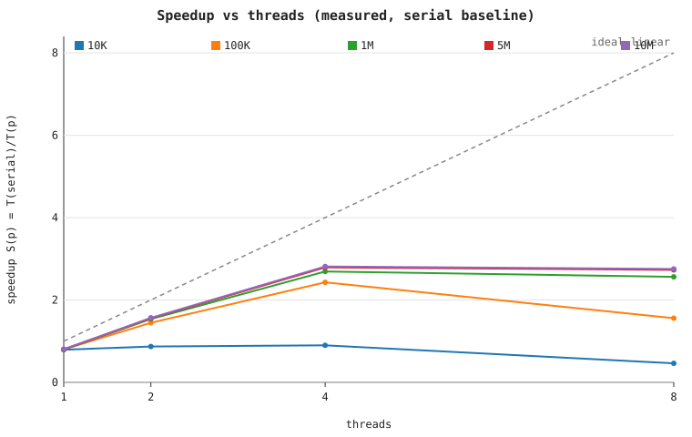
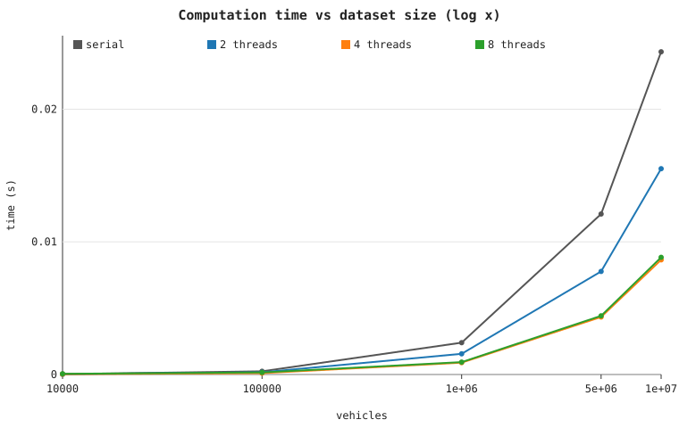
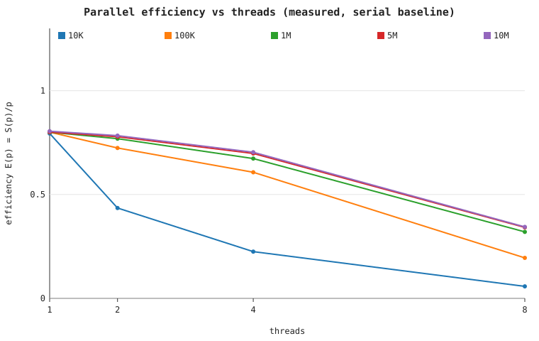

# Benchmark results and discussion

> **Every number on this page was measured by running the compiled binaries
> on the machine described in `docs/objective.md` (Apple M2, 8 cores, 16 GiB,
> LLVM clang 22.1.8 `-O2 -fopenmp`). Nothing is fabricated or extrapolated.**
> The raw data is `benchmarks/results/benchmark_results.csv`; the table below
> is the auto-generated `benchmarks/results/benchmark_summary.md`.

## Method

* **What is timed:** only the analysis computation. CSV parsing and printing
  happen outside the timed region in both binaries
  (`std::chrono::high_resolution_clock`).
* **Statistic:** each binary reports the *best of N* inner iterations
  (`--iterations`); the harness runs each cell *7 times* and reports the
  **median** (min/max spread is kept in the CSV so run-to-run variance is
  visible).
* **Same conditions:** identical input files, compiler, flags (`-O2`),
  machine, and metric code for serial and parallel runs.
* **Baselines:** two are reported.
  * `S(serial) = T(serial)/T(p)` — the textbook speedup against the dedicated
    serial program.
  * `S(omp1) = T(omp-1-thread)/T(p)` — isolates pure thread scaling from the
    constant cost of entering an OpenMP parallel region.
  * `Efficiency = S(serial)/p`.

## Measured table

The full measured table (with both baselines and efficiency) is in
[`benchmarks/results/benchmark_summary.md`](../benchmarks/results/benchmark_summary.md).
Serial-baseline slice of that table (median seconds; all five datasets —
10K included because it shows the small-input regression):

| Dataset | Serial (s) | 2 thr | 4 thr | 8 thr | best S(serial) |
|---------|-----------|-------|-------|-------|----------------|
| 10K     | ~2.4e-5   | 0.87× | 0.90× | 0.46× | never > 1 |
| 100K    | ~2.4e-4   | 1.45× | 2.43× | 1.56× | 2.43× @ 4 |
| 1M      | ~2.4e-3   | 1.54× | 2.69× | 2.56× | 2.69× @ 4 |
| 5M      | ~1.2e-2   | 1.56× | 2.79× | 2.73× | 2.79× @ 4 |
| 10M     | ~2.4e-2   | 1.57× | 2.82× | 2.75× | 2.82× @ 4 |

## Graphs





## What the data shows

1. **Time is linear in N.** Across 100K→10M (a 100× range) the serial time
   grows ~100× (≈2.4e-4 s → ≈2.4e-2 s). This empirically confirms the O(N)
   analysis in `docs/complexity.md`.

2. **Scaling saturates at 4 threads and is bandwidth-bound.** Speedup rises
   from ~1.5× at 2 threads to a plateau of ~2.8× at 4 threads, then *stops or
   slightly regresses* at 8. The kernel performs only ~3 FLOPs per ~32-byte
   record (arithmetic intensity ≈ 0.1 FLOP/byte), so a handful of cores
   already saturate the memory bus. Beyond that, extra threads queue on
   bandwidth rather than compute. This is the expected ceiling for a
   streaming reduction and is the project's central honest finding.

3. **Small datasets don't parallelize.** At 10K the whole computation is
   ~30 µs, comparable to the cost of creating/waking a thread team, so
   OpenMP is *slower* than serial (speedup < 1, worst at 8 threads). This is
   Amdahl's law plus fixed parallel overhead dominating a tiny workload.

4. **Efficiency falls with thread count.** From ~78% (2 threads) to ~35%
   (8 threads) on large data — the signature of a memory-bound kernel, not of
   a correctness or load-balance problem.

## Why speedup is not linear (causes, tied to the measurements)

| Cause | Evidence in the data |
|-------|----------------------|
| Memory-bandwidth saturation | plateau at 4 threads on all large datasets |
| Thread-team startup + reduction overhead | 10K runs slower than serial |
| Limited parallel fraction (Amdahl) | load/average/print stay serial |
| Cache effects | working set exceeds cache beyond a few threads |
| Fixed 8-core hardware | no gain, occasional regression, at 8 threads |

## Reproduce

```bash
make benchmark        # builds, generates datasets, runs, plots
# or
python3 benchmarks/run_benchmark.py --build-dir build
```

Results will differ in absolute terms on other hardware but should show the
same qualitative behaviour: linear-in-N time, a low-thread-count speedup
plateau, and <1 speedup on very small inputs.
